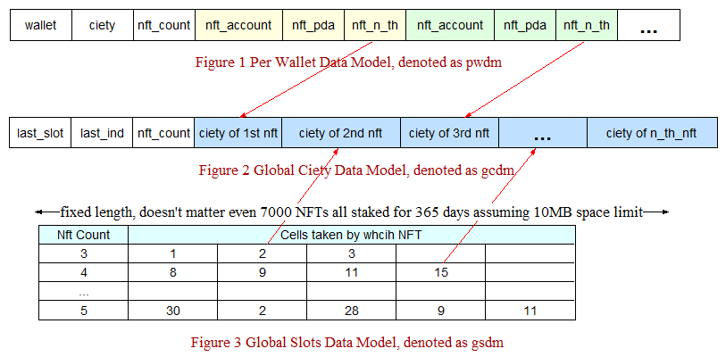

# Core Data Model




# Facts

When calculating rewards, even with 1 NFT on 230 slots, the complete business logics sonsumes 192,853 compute units, while the limit is 200,000. The following the is the log of running smart contract from the chain.

```shell
Streaming transaction logs mentioning 9MJzW1oEzvjHnmdLdoGRGr1i4hu82g7eEEnxvmifcDZD. Confirmed commitment
Transaction executed in slot 102407669:
  Signature: 2k5hDhQxL1vdWL5ZDe2e3z86sXywQUAfX4U2jUsDM2pvhc62VgD5iRyVZH1uj9Su9jM2xvCpXCV5WQhGmgmNUCWb
  Status: Ok
  Log Messages:
    Program HAoqALFTiyibSRgh63qUWX1sdxt82R3hCqSwAmk8Pysw invoke [1]
    Program consumption: 198301 units remaining
    Program log: [Reward 1] Resolve accounts
    Program log: [Reward 2] Get proj config
    Program log: [Reward 3] Load Gcdm
    Program log: [Reward 4] Load Gsdm
    Program log: [Reward 5] Calc current slot
    Program log: [Reward 6] Iterate over slot gap and update Gcdm
    Program consumption: 197488 units remaining
    Program log: nft_count=========1
    Program log: nft_count=========1
    Program log: nft_count=========1
    Program log: nft_count=========1
    Program log: nft_count=========1
    Program consumption: 8120 units remaining
    Program log: [Reward 7] Update Pwdm
    Program log: [Reward 8] Save Pwdm
    Program log: [Reward 9] Save Gcdm
    Program log: [Reward 10] Reward is completed!
    Program HAoqALFTiyibSRgh63qUWX1sdxt82R3hCqSwAmk8Pysw consumed 192853 of 200000 compute units
    Program HAoqALFTiyibSRgh63qUWX1sdxt82R3hCqSwAmk8Pysw success
```

This project involvs very complex reward calculating logic, in order to reduce the compute unit consumptions, It doesn't even use any highly capsulated ease-use construct, such as Vec, BTreeMap etc, since they have lots of overhead, actually nothing but pure [u8] manipulation alone, basically no headroom to squeeze the performance any further.

